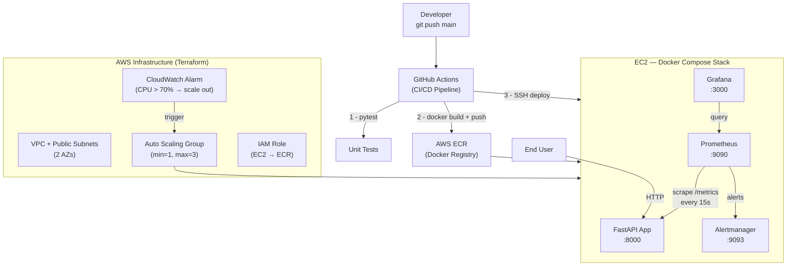

# SRE Final — Production Readiness Review

> **E-commerce Product Catalog Microservice** — полный production-ready стек:  
> FastAPI · Docker · AWS (EC2 + ECR + ASG) · Terraform · Prometheus · Grafana · GitHub Actions

---

## Архитектурная диаграмма



---

## Tech Stack

| Layer | Technology |
|---|---|
| Application | FastAPI 0.111, Python 3.12, uvicorn |
| Metrics | prometheus-client, Prometheus 2.52 |
| Visualisation | Grafana 10.4 |
| Alerting | Alertmanager 0.27 |
| Containerisation | Docker, Docker Compose 2.27 |
| Infrastructure | Terraform 1.7+, AWS (EC2, ECR, VPC, ASG, CloudWatch) |
| CI/CD | GitHub Actions |
| Load testing | Locust |
| Testing | pytest, pytest-asyncio, httpx |

---

## Prerequisites

```bash
# Local machine
aws --version          # AWS CLI v2
terraform --version    # >= 1.7.0
docker --version       # >= 24.0
docker compose version # >= 2.20
python --version       # >= 3.12 (for local tests)
locust --version       # optional, for load tests

# AWS account
# - IAM user with permissions: EC2, ECR, VPC, IAM, S3, DynamoDB, CloudWatch
# - Key pair created in target region
# - S3 bucket + DynamoDB table for Terraform state (see terraform/main.tf)
```

---

## Quick Start — Deploy from Scratch

### Step 1: Clone the repository
```bash
git clone https://github.com/KasperSaint07/SRE_final.git
cd SRE_final
```

### Step 2: Bootstrap Terraform state backend
```bash
# Create S3 bucket for state
aws s3 mb s3://sre-final-tfstate-bucket --region us-east-1
aws s3api put-bucket-versioning \
    --bucket sre-final-tfstate-bucket \
    --versioning-configuration Status=Enabled

# Create DynamoDB table for state locking
aws dynamodb create-table \
    --table-name sre-final-tfstate-lock \
    --attribute-definitions AttributeName=LockID,AttributeType=S \
    --key-schema AttributeName=LockID,KeyType=HASH \
    --billing-mode PAY_PER_REQUEST \
    --region us-east-1
```

### Step 3: Configure and apply Terraform
```bash
cd terraform

# Copy and edit variables
cp terraform.tfvars.example terraform.tfvars
# Edit: set key_pair_name, aws_region, etc.

terraform init
terraform plan
terraform apply
```

### Step 4: Note the outputs
```bash
terraform output
# ec2_public_ip    = "x.x.x.x"
# ecr_repository_url = "123456789.dkr.ecr.us-east-1.amazonaws.com/sre-final-app"
```

### Step 5: Configure GitHub Secrets
```
AWS_ACCESS_KEY_ID       → your IAM access key
AWS_SECRET_ACCESS_KEY   → your IAM secret key
EC2_HOST                → ec2_public_ip from terraform output
EC2_SSH_KEY             → content of your .pem private key file
GRAFANA_PASSWORD        → desired Grafana admin password
```

### Step 6: Copy monitoring configs to EC2
```bash
EC2_IP=$(terraform output -raw ec2_public_ip)
scp -i ~/.ssh/your-key.pem -r \
    ../monitoring \
    ../docker-compose.yml \
    ec2-user@$EC2_IP:/opt/sre-app/
```

### Step 7: Push to main — CI/CD deploys automatically
```bash
cd ..
git add .
git commit -m "feat: initial production deploy"
git push origin main
```

The GitHub Actions pipeline will:
1. Run pytest tests
2. Build and push Docker image to ECR
3. SSH into EC2 and run `docker compose up -d`

### Step 8: Verify deployment
```bash
# Application health
curl http://$EC2_IP:8000/health

# List products
curl http://$EC2_IP:8000/products

# Prometheus targets
open http://$EC2_IP:9090/targets

# Grafana dashboards (admin / your-password)
open http://$EC2_IP:3000
```

---

## Repository Structure

```
SRE_final/
├── app/
│   ├── main.py                    FastAPI application (in-memory product catalog)
│   ├── requirements.txt           Python dependencies
│   ├── Dockerfile                 Multi-stage Docker build
│   └── tests/
│       └── test_main.py           Pytest test suite (14 tests)
│
├── terraform/
│   ├── providers.tf               AWS provider + S3/DynamoDB backend
│   ├── variables.tf               All input variables
│   ├── outputs.tf                 Public IP, ECR URL, ASG name, etc.
│   ├── main.tf                    Bootstrap documentation
│   ├── vpc.tf                     VPC, subnets, IGW, route tables
│   ├── security-groups.tf         SG: ports 22/80/443/3000/8000/9090/9093
│   ├── ec2.tf                     Standalone EC2 + Elastic IP
│   ├── ecr.tf                     ECR repo + IAM role/profile
│   ├── asg.tf                     Launch Template + ASG + CloudWatch alarms
│   ├── user-data.sh               Docker install on first boot
│   └── terraform.tfvars.example   Variable template (no secrets)
│
├── docker-compose.yml             Full observability stack (app+prom+grafana+am)
│
├── .github/workflows/
│   └── ci-cd.yml                  Test → Build+Push → Deploy pipeline
│
├── monitoring/
│   ├── prometheus/
│   │   ├── prometheus.yml         Scrape configs (FastAPI + self + alertmanager)
│   │   └── alert-rules.yml        HighErrorRate / HighLatency / InstanceDown / ErrorBudgetBurn
│   ├── grafana/
│   │   ├── provisioning/
│   │   │   ├── datasources/prometheus.yml   Auto-connect to Prometheus
│   │   │   └── dashboards/dashboard.yml     Auto-import dashboards
│   │   └── dashboards/
│   │       ├── app-dashboard.json           Request Rate, Latency p50/95/99, Error Rate, Status codes
│   │       └── infra-dashboard.json         CPU, Memory, Network, Scrape duration
│   └── alertmanager/
│       └── alertmanager.yml       Routing tree + receivers (webhook/email)
│
├── sre/
│   ├── slo-document.md            SLI/SLO definitions + Error Budget Policy
│   ├── load-test/
│   │   ├── locustfile.py          Load scenarios (ramp 10→200 users)
│   │   └── README.md             How to run load tests
│   └── runbook.md                 Alert runbooks (HighErrorRate/HighLatency/InstanceDown)
│
├── docs/
│   ├── architecture.md            Component diagram + data flows + security
│   ├── scaling-strategy.md        ASG logic, thresholds, capacity planning
│   └── incident-response.md       P1-P4 incident lifecycle + postmortem template
│
├── .gitignore
└── README.md                      ← you are here
```

---

## Screenshots

> Replace these placeholders with real screenshots after deployment.

### CI/CD Pipeline

*GitHub Actions: Test → Build & Push → Deploy — три успешных job'а*

### Grafana — Application Dashboard

*Request Rate, Latency p50/p95/p99, Error Rate, HTTP Status Distribution*

### Grafana — Infrastructure Dashboard

*Container CPU, Memory, Network I/O*

### Prometheus Alerts

*HighErrorRate, HighLatency, InstanceDown, ErrorBudgetBurn — все в состоянии INACTIVE*

### Load Test Results (Locust)

*200 пользователей, spawn rate 10/s, p99 < 300ms, 0% failures*

### Auto Scaling

*CloudWatch alarm CPU > 70% → ASG scale-out: 1 → 2 инстанса*

---

## Useful Commands

```bash
# Run tests locally
cd app && pip install -r requirements.txt
python -m pytest tests/ -v

# Start full stack locally (without ECR)
docker build -t sre-final-app ./app
ECR_REGISTRY=local ECR_REPOSITORY=sre-final-app IMAGE_TAG=latest \
  docker compose up -d

# Check all services
docker compose ps
docker compose logs -f

# Run load test
pip install locust
locust -f sre/load-test/locustfile.py --host http://localhost:8000

# Terraform plan with var overrides
cd terraform
terraform plan -var="ec2_instance_type=t3.small"
```

---

## SLOs at a Glance

| SLI | Target | Alert |
|---|---|---|
| Availability | ≥ 99.9% | InstanceDown |
| Latency p99 | < 300 ms | HighLatency (fires at > 500 ms) |
| Error Rate | < 0.1% | HighErrorRate (fires at > 5%) |

**Error budget:** 43 minutes of downtime per month.  
See [sre/slo-document.md](sre/slo-document.md) for full details.
